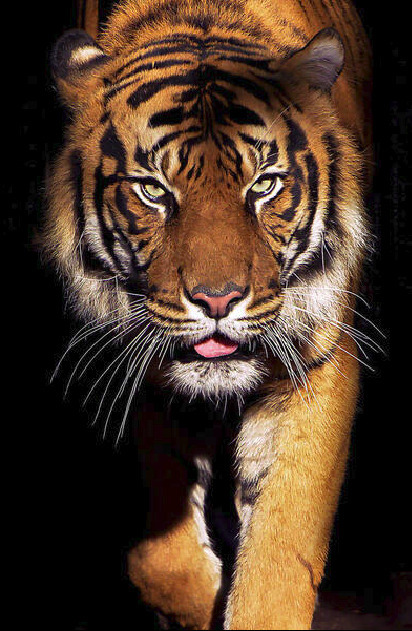

# A Community Blog for Environmental Change Profile Website
Wildlife Society, this is community blog dedicated to promoting environmental awareness and sustainable living website build with HTML and CSS. It includes sections for Home, About, Project, Team, Galery, and Contact.

## Table of Contents
1. [Introduction](#home)
2. [About Us](#about)
3. [What We Do](#project)
4. [Team](#team)
5. [Galery](#galery)
6. [Contact Us](#contact)


## Features of Wildlife Society Blog
1. User-Friendly Navigation with intuitive layout and design for easy browsing.
2. Commenting System alow reader to leave comments and feedback.
3. Galery about news and developments in wildlife conservation content.
4. Regular Project and Programe for world between people and nature.
5. Contact Form with service section.
6. Footer with copyright information.

## Technologies Used
- HTML5 and CSS

## Setup
1. Clone the repository:
    ```bash
    git clone https://github.com/revou-fsse-oct24/module-1-ferianai.git
    ```
2. Navigate to the project directory:
    ```bash
    cd module-1-ferianai
    ```
3. Open the `index.html` file in your browser:
    ```bash
    open index.html
    ```
4. **Image Folder** (img folder will located in the repository module-1-ferianai) to call it into html you can use " img/ " :
    ```bash
    
    
    ```

## Code
I use structire and semantics page and give class for each section.

> example :

```bash
<header class="header" id="top-page">
    <div class="container-header">
      <nav class="nav mobile-container">
        <input type="checkbox" id="check">
        <label for="check" class="labelbar">
          <i class="fas fa-bars" id="btn"></i>
          <i class="fas fa-times" id="cancel"></i>
        </label>
        <a class="logo" href="#">
          <i class="fa fa-leaf" aria-hidden="true" id="logo"></i>WILDLIFE SOCIETY
        </a>
        <div class="navbar">
          <ul>
            <li> <a href="#home">Home</a> </li>
            <li> <a href="#about">About</a> </li>
            <li> <a href="#project">Project</a> </li>
            <li> <a href="#team">Team</a> </li>
            <li> <a href="#galery">Galery</a> </li>
            <li> <a href="#contact">Contact</a> </li>
          </ul>          
        </div>
      </nav>
    </div>
  </header>
```

## Page Overview applying Responsive Design with media query 
### Desktop Template


### Tablet Template


### Mobile Template


